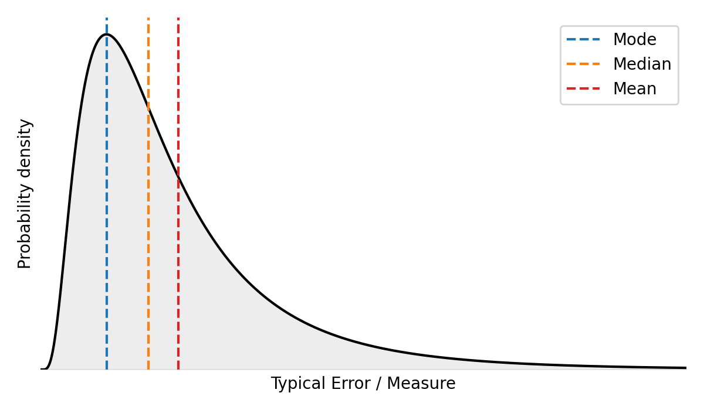

# Skew: The Shape that Defies Intuition

Almost every hard problem that I've encountered in applying optimization and logistics can be traced back to the same thing: the distributions are not symmetric.
They lean hard to the right, they have a long tail, and the tail is where the pain lives.
This post is about where that skew comes from, what it does to an optimizer, and why the average is usually a bad or unintuitive metric.
The human intuition has a hard time working with situations where the average significantly differs from the median, which is the case when there's skew.

## Why Does Optimization Usually Produce Skew?

Optimization usually has some sort of bound for how good a thing can be.
The price of things cannot go below zero.
The distance of a traversed route or its segments cannot go below zero.
The time it takes to deliver an item cannot be negative.

However, there is often no bound for how bad things can get.
There is no limit for how expensive things can be, or how far you'll travel or how long you'll need to wait for your shipment.
This limit in one direction but not in the other makes any distribution involved in an optimization process usually heavily skewed.
You can arrange most things to happen quite well but there's a long tail of things like shipments where you're faced with increasingly bad options.

In logistics the predictions also have this property.
This relates to the unilateral flow of time.
Once you're late you can only ever be later.
Earliness can be resolved by simply waiting but lateness just keeps on getting worse.
Also when you predict that it takes 10 minutes to travel somewhere you can only ever be 10 minutes early (by arriving instantly).
But there's no limit to how late you can be from that estimate.
Thus physics arranges all logistics operations to have heavily skewed distributions.

So the distribution of delivery times, lateness, and pretty much every other duration in the system is **bounded below and unbounded above**.
You are more likely to be late than early, and when you are late you can be spectacularly late.
That is a right-skewed distribution, and the **mode**, the **median** and the **mean** all sit in very different places.



A heavily right-skewed distribution has a long tail towards the large values.
There is a limit for how fast or early you can be, but the duration and the lateness are unbounded.
The mode, the median and the mean fan out to the right and differ significantly from each other.

The three statistics fanning out to the right is the whole problem in one picture.
In a symmetric distribution they coincide and it does not matter which one you base your operations on.
Here they are three different numbers, and picking one is a decision about how your system behaves.

## Which Statistic Do You Plan With?

Once the three statistics separate, you are forced into a choice, and every option costs you something.

If you plan against the **mean**, you will be early most of the time.
You get chains of early deliveries, which are then corrected back to the mean by rare but large lateness.
The system looks good on the dashboard and feels erratic to the customer.

If you plan against the **mode or the median**, you stop building up chains of earliness.
But now the tail events hit you with nothing absorbing them, and the lateness lands on the customer at full force.
Furthermore, the lateness does compound.
The last deliveries in a chain of deliveries suffer from the lateness of all the preceding deliveries.

There is no free option here.
My honest advice is to be very deliberate about the statistic you pick as your goal, because the choice propagates through everything downstream.
The mean is the default in most organizations mostly because it is easy to compute, it is what everyone was taught, and the Central Limit Theorem makes it pleasant to work with.
Also financial calculations are usually based on the averages.
However, none of those are reasons that it describes your operations well.

A more useful framing is to stop trying to compress the distribution into one number.
Use the **median to describe the typical experience** and the **90th percentile to describe the worst-case experience**.
Or set explicit service level goals and report the rate at which they are met: what fraction of deliveries took under 20 minutes.
That tells you something the mean structurally cannot.

## The Average Hides the Shape

Here is the cleanest demonstration I know of why the average lies to you.
These two series of delivery durations have the same average:

```
20, 20, 20, 20, 20, 21, 21, 21, 21, 21
20, 20, 20, 20, 20, 20, 20, 20, 20, 25
```

In the first scenario you learn that delivery takes 20 to 21 minutes, and you plan your evening around that.
In the second one you learn that delivery takes 20 minutes, and you will absolutely notice the one time in ten that it took 25.
People anchor on the likely outcome and discount the improbable one, and will be sure to notice and remember when it happens to them.
Same mean, completely different experience.

## Long Routes Make It Worse

Skew compounds, and this is where long routes get genuinely dangerous.

Grant yourself the friendly assumptions for a moment.
Assume the per-leg prediction errors $e_i$ are independent, identically distributed, and have **zero mean**.
Then the variances add along a route of $I$ legs, and the standard deviation of the accumulated error grows as

$$\sigma_{1:I} = \sqrt{I}\ \sigma$$

That already means you must improve per-leg prediction by a factor of $\sqrt{I}$ just to hold the accumulated precision steady as routes get longer.
Also the compounding in practice is worse than $\sqrt{I}$, and the $\sqrt{I}$ result is the best case you could theoretically ever see.

The zero-mean assumption is exactly the one that skew destroys in practical settings.
If you base the operations on a metric other than the mean, there's bias and the bias grows by construction as the route does.
Furthermore, the bias will grow like $I$ rather than $\sqrt{I}$ because the biases of individual legs never cancel each other out.
Additionally, the skew means that even if you do base your operations on the average, the realized lateness, duration or other time-related measure is even more strongly dominated by rare tail events.
You'll keep on getting earlier and earlier, which is occasionally offset by a huge lateness.

## Skew Poisons Your Measurement Too

Because you cannot lean on the Central Limit Theorem, most of the convenient statistical machinery is unavailable.
The literature focuses on the mean largely because the theorem makes it tractable, and the theorem does not extend to the median or to percentiles.

**Bootstrap aggregation** is a practical way out.
Resample your data with replacement many times, recompute the statistic you actually care about on each resample, and read the uncertainty off the spread of those values.
It assumes nothing about the shape of the underlying distribution, which is the whole reason it works here.
